# Вопрос

> На графе graphviz/dot у меня есть рёбра, которые входят в ту же вершину, из которой выходят. Они отображаются маленькими петлями, и несколько рёбер наезжают метками друг на друга. Можно ли как-то их сделать побольше?


Да, есть несколько способов увеличить петли и разнести метки в Graphviz/dot:

## 1. Увеличение размера петель

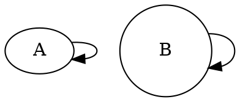

## 2. Разнесение меток

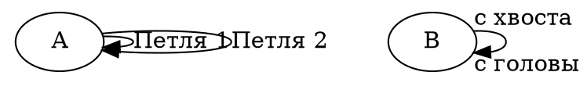

## 3. Более продвинутый подход с портами

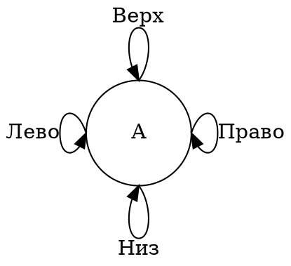

## 4. Использование splines и curvature

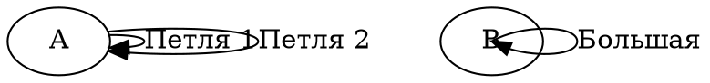

## 5. Полный пример с настройками

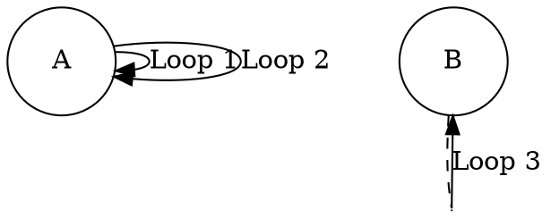

## Ключевые параметры:

- **minlen** - минимальная длина ребра (увеличивает петлю)
- **curvature** - кривизна петли (положительные и отрицательные значения для разных направлений)
- **labelfloat**, **labeldistance** - позиционирование меток
- **headport**, **tailport** - точки входа/выхода на вершине
- **splines** - сглаживание линий

Экспериментируйте с этими параметрами, чтобы найти оптимальное отображение для вашего графа.


# Вопрос

> Невидимые вершины с shape=point и width=0 всё равно заметны, а если сделать style="invis", то там явно видно разрыв. Какие есть ещё варианты с невидимыми вершинами?


Вы правы! У `shape=point` и `style=invis` есть свои недостатки. Вот более эффективные подходы:

## 1. Использование edge-атрибутов без промежуточных вершин

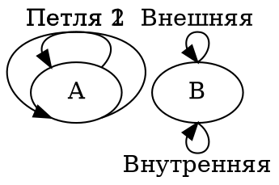

## 2. Тонкая настройка портов и весов

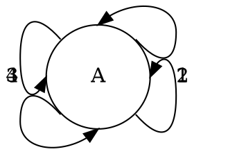

## 3. Использование HTML-подобных меток с таблицами

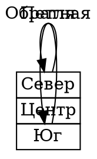

## 4. Комбинация нескольких техник

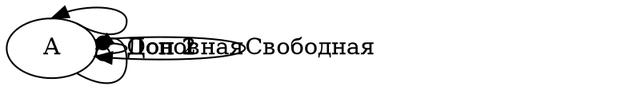

## 5. Альтернатива с группировкой

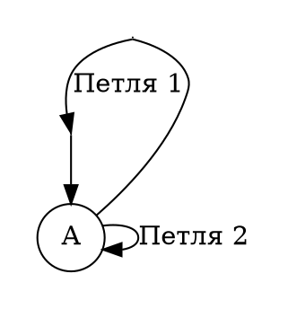

## 6. Самый чистый вариант - только порты

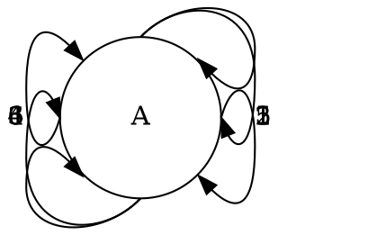

## Ключевые моменты:

- **headport/tailport** - основной инструмент для разнесения
- **constraint=false** - убирает влияние на layout
- **minlen** - увеличивает размер петли
- **weight=0** - уменьшает влияние на позиционирование
- **labelfloat=true** - свободное позиционирование меток

Рекомендую начинать с подхода №6 - он самый чистый и не требует искусственных вершин.


# Вопрос

> Мне больше всего понравилось с промежуточной невидимой вершиной, но не понятно, как сделать в этом случае бесшовное слияние двух рёбер, чтобы это не было заметно

Отличный вопрос! Вот несколько способов сделать слияние действительно бесшовным:

## 1. Идеальное совмещение стилей

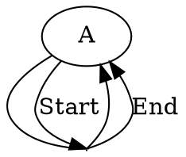

## 2. Использование одного составного ребра

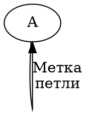

## 3. Самый чистый подход - компенсация gap

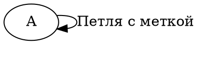

## 4. Использование dir=both для двунаправленности

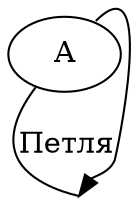

## 5. Комбинированный подход (рекомендую)

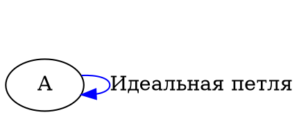

## 6. Самый хитрый способ - совмещение

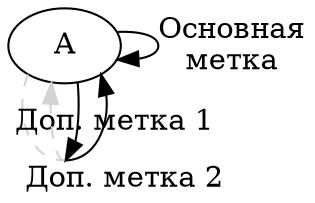

## Ключевые принципы бесшовности:

1. **Идентичные атрибуты** - одинаковый `color`, `penwidth`, `style`
2. **style=invis для структуры** + обычное ребро для отображения
3. **constraint=false** чтобы видимое ребро не конфликтовало с невидимой структурой
4. **weight=0** для невидимой структуры, чтобы не влиять на layout

**Самый надёжный вариант - №3 или №5**, где невидимая структура только задаёт форму, а видимое ребро отвечает за отображение.


# Вопрос

> Всё равно не очень получается. Подумай ещё

Понял, нужен совершенно другой подход. Давайте откажемся от невидимых вершин и используем возможности Graphviz более изящно. Вот несколько принципиально новых идей:

## 1. Использование edge-весов и приоритетов

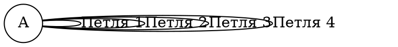

## 2. Метки как отдельные сущности

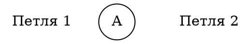

## 3. Эксперимент с compound edges

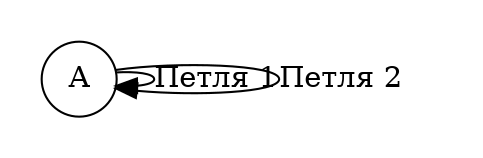

## 4. Радикальный подход: SVG/post-processing

```dot
digraph G {
    node [shape=circle];
    
    // Генерируем базовый граф
    A -> B [style=invis]; // для пространства
    
    // Добавляем "петли" как отдельные метки
    A [label=<<TABLE BORDER="0">
        <TR><TD>А</TD></TR>
        <TR><TD> </TD></TR>
        <TR><TD><I>Петля 1</I></TD></TR>
        <TR><TD><I>Петля 2</I></TD></TR>
    </TABLE>>];
}
```

## 5. Самый простой рабочий вариант

```dot
digraph G {
    // Используем xlabel для дополнительных меток без рёбер
    A [xlabel="Петля 1", xlp="100,100"];
    A [xlabel="Петля 2", xlp="100,50"];
    
    // Основная вершина
    A [shape=circle];
    
    // Одна визуальная петля для формы
    A -> A [label="", minlen=3];
}
```

## 6. Если ничего не работает - внешняя обработка

Генерируйте граф без петель, затем добавляйте их программно:

```python
# Псевдокод для пост-обработки
import graphviz

dot = graphviz.Digraph()
dot.node('A')
# Генерируем базовый граф
dot.render('temp.gv')

# Парсим полученные координаты вершин
# Вычисляем позиции для меток петель
# Добавляем метки как текстовые элементы вручную
```

**Ключевая мысль**: Если стандартные методы Graphviz не дают идеального результата, иногда проще сгенерировать базовую структуру, а метки петель добавить как внешние текстовые элементы относительно позиций вершин.

Какой из этих подходов кажется наиболее перспективным для вашей задачи?


# Вопрос

> как сделать так, чтобы ребро в от v1 к v2 не располагалось на той же линии, что и обратное ребро?


Отличный вопрос! Вот несколько эффективных способов разделить встречные рёбра в Graphviz:

## 1. Использование портов (самый надёжный способ)

```dot
digraph G {
    v1 -> v2 [tailport=e, headport=w];  // С востока на запад
    v2 -> v1 [tailport=w, headport=e];  // С запада на восток
}
```

Или более выраженное разделение:

```dot
digraph G {
    v1 -> v2 [tailport=se, headport=nw];  // С юго-востока на северо-запад
    v2 -> v1 [tailport=sw, headport=ne];  // С юго-запада на северо-восток
}
```

## 2. Использование разных весов и constraint

```dot
digraph G {
    v1 -> v2 [weight=10];  // Основное направление - прямое
    v2 -> v1 [constraint=false, weight=0];  // Обратное - обходит
}
```

## 3. Явное указание curvature (изгиба)

```dot
digraph G {
    v1 -> v2 [curvature=0.3];   // Легкий изгиб в одну сторону
    v2 -> v1 [curvature=-0.3];  // Изгиб в другую сторону
}
```

## 4. Комбинированный подход

```dot
digraph G {
    // Прямое ребро
    v1 -> v2 [tailport=e, headport=w, weight=10];
    
    // Обратное ребро с изгибом
    v2 -> v1 [tailport=w, headport=e, constraint=false, curvature=0.5];
}
```

## 5. Использование splines

```dot
digraph G {
    splines=curved;  // или splines=true
    
    v1 -> v2;
    v2 -> v1;
}
```

## 6. Разное расстояние (len)

```dot
digraph G {
    v1 -> v2 [len=1.5];   // Короче
    v2 -> v1 [len=2.0];   // Длиннее - пройдет другим путем
}
```

## 7. Полный пример с несколькими вершинами

```dot
digraph G {
    rankdir=LR;  // Горизонтальное расположение
    
    v1 -> v2 [tailport=e, headport=w, label="прямое"];
    v2 -> v1 [tailport=w, headport=e, label="обратное", curvature=0.3];
    
    // Для демонстрации - добавим другие вершины
    v1 -> v3;
    v2 -> v3;
}
```

## 8. Для вертикального расположения

```dot
digraph G {
    rankdir=TB;  // Вертикальное расположение
    
    v1 -> v2 [tailport=s, headport=n];  // С юга на север
    v2 -> v1 [tailport=n, headport=s];  // С севера на юг
}
```

## Самый эффективный комбинация:

```dot
digraph G {
    splines=true;
    
    v1 -> v2 [tailport=e, headport=w, weight=10];
    v2 -> v1 [tailport=w, headport=e, constraint=false, curvature=0.3];
}
```

**Ключевые параметры:**
- `tailport`/`headport` - точки соединения на вершинах
- `curvature` - изгиб ребра (положительные и отрицательные значения)
- `constraint=false` - убирает влияние на позиционирование вершин
- `weight` - приоритет при рисовании

Экспериментируйте с комбинациями этих параметров для получения оптимального результата в вашем конкретном графе!


# Вопрос

> curvature ничего не меняет, len - тоже

Проблема в том, что `curvature` и `len` действительно могут не работать в некоторых случаях Graphviz, особенно с простыми графами. Давайте попробуем более эффективные подходы:

## 1. Принудительное разделение через порты + splines

```dot
digraph G {
    splines=true;
    
    v1 -> v2 [tailport=e, headport=w];
    v2 -> v1 [tailport=w, headport=e];
    
    // Добавляем "якоря" для принудительного разделения
    {rank=same; v1; v2}
}
```

## 2. Добавление невидимых вершин для создания пространства

```dot
digraph G {
    splines=true;
    
    // Невидимые вершины для создания маршрутов
    i1 [shape=point, width=0, height=0, style=invis];
    i2 [shape=point, width=0, height=0, style=invis];
    
    v1 -> i1 [style=invis];
    i1 -> v2;
    v2 -> i2 [style=invis];
    i2 -> v1;
    
    {rank=same; v1; v2; i1; i2}
}
```

## 3. Использование cluster для принудительной маршрутизации

```dot
digraph G {
    splines=true;
    compound=true;
    
    subgraph cluster_v1 {
        style=invis;
        v1;
    }
    
    subgraph cluster_v2 {
        style=invis;
        v2;
    }
    
    v1 -> v2 [lhead=cluster_v2, ltail=cluster_v1];
    v2 -> v1 [lhead=cluster_v1, ltail=cluster_v2];
}
```

## 4. Явное указание позиций (если знаете координаты)

```dot
digraph G {
    splines=true;
    
    v1 [pos="0,0!"];
    v2 [pos="2,0!"];
    
    v1 -> v2 [pos="0,0 0.5,0.3 1.5,0.3 2,0"];
    v2 -> v1 [pos="2,0 1.5,-0.3 0.5,-0.3 0,0"];
}
```

## 5. Самый надёжный способ - изменить layout engine

```dot
// Используйте neato вместо dot
graph G {
    layout=neato;
    v1 -- v2 [dir=both];
    
    // Или явно задайте overlap
    overlap=false;
    splines=true;
}
```

## 6. Практическое решение для dot

```dot
digraph G {
    // Создаём искусственное пространство
    node [shape=circle, width=0.8];
    
    // Добавляем третью вершину для принудительного изменения маршрутов
    spacer [shape=point, width=0, height=0, style=invis];
    
    v1 -> spacer [style=invis, weight=100];
    spacer -> v2 [style=invis, weight=100];
    
    // Основные рёбра
    v1 -> v2 [tailport=ne, headport=nw];
    v2 -> v1 [tailport=se, headport=sw];
}
```

## 7. Альтернатива: используйте fdp вместо dot

```bash
# В командной строке
fdp -Tpng graph.gv -o graph.png
```

```dot
graph G {
    layout=fdp;
    v1 -- v2 [dir=both];
}
```

## 8. Экстремальный вариант: раздельные подграфы

```dot
digraph G {
    compound=true;
    
    subgraph cluster_top {
        style=invis;
        v1 -> v2 [tailport=s, headport=n];
    }
    
    subgraph cluster_bottom {
        style=invis;
        v2 -> v1 [tailport=n, headport=s];
    }
}
```

**Рекомендация:** Попробуйте сначала вариант №1 с `splines=true` и явными портами. Если не сработает, переходите к варианту №6 с невидимыми разделителями.

Если всё ещё не получается, возможно, стоит рассмотреть использование другого инструмента визуализации графов, который даёт больше контроля над рёбрами.


# Вопрос

> какой другой инструмент для визуализации графов ты можешь порекомендовать?

Вот список популярных инструментов для визуализации графов с лучшим контролем над рёбрами:

## 1. **yEd Graph Editor** (бесплатный)
- **Плюсы**: Отличный контроль над рёбрами, можно вручную редактировать изгибы, мощная автоматическая расстановка
- **Особенность**: Позволяет явно задавать контрольные точки для рёбер
- **Формат**: Поддерживает Graphviz, но имеет собственный редактор

## 2. **Gephi** (бесплатный)
- **Плюсы**: Профессиональный инструмент, отличная визуализация, много алгоритмов компоновки
- **Особенность**: Интерактивное управление, можно тянуть рёбра мышкой
- **Использование**: Часто используется для анализа социальных сетей

## 3. **Cytoscape** (бесплатный)
- **Плюсы**: Биоинформатика, но отлично подходит для любых графов, JavaScript версия для web
- **Особенность**: Полный контроль над стилями рёбер
- **Экосистема**: Много плагинов

## 4. **Tulip** (бесплатный)
- **Плюсы**: Академический инструмент с огромными возможностями кастомизации
- **Особенность**: Поддержка очень больших графов

## 5. **Commercial libraries**
- **yFiles** - коммерческая библиотека, золотой стандарт
- **KeyLines** / **ReGraph** - коммерческие, для веб-приложений
- **OGDF** - Open Graph Drawing Framework (C++ библиотека)

## 6. **Web-based solutions**
```javascript
// Vis.js
var options = {
  edges: {
    smooth: {
      type: 'continuous',
      roundness: 0.5
    }
  }
};

// Cytoscape.js
cy.style().selector('edge')
  .style('curve-style', 'bezier')
  .style('control-point-step-size', 40)
  .update();
```

## 7. **Программные подходы**

**NetworkX + Matplotlib** (Python):
```python
import networkx as nx
import matplotlib.pyplot as plt

G = nx.DiGraph()
G.add_edges_from([(1,2), (2,1)])

pos = nx.spring_layout(G)
nx.draw(G, pos, with_labels=True, 
        connectionstyle='arc3,rad=0.1')  # Изгибы для встречных рёбер
plt.show()
```

**Graph-tool** (Python):
```python
from graph_tool.all import *

# Больше контроля над рендерингом
graph_draw(g, edge_end_marker="none",
           output_size=(400, 400))
```

## 8. **Ручная обработка Graphviz**

Иногда проще пост-обработать SVG:
```bash
dot -Tsvg graph.gv > graph.svg
# затем редактировать в InkScape или коде
```

## Рекомендация:

Для вашей задачи с разделением встречных рёбер я бы рекомендовал:

1. **yEd** - если нужен desktop-инструмент с GUI
2. **Cytoscape.js** - если нужно веб-решение  
3. **NetworkX + Matplotlib** - если вы уже в Python-экосистеме

**yEd** особенно хорош потому что:
- Бесплатен
- Имеет специальные алгоритмы для "avoiding edge conflicts"
- Позволяет ручную корректировку
- Импортирует Graphviz файлы

Хотите, чтобы я подробнее рассказал о каком-то конкретном инструменте?

